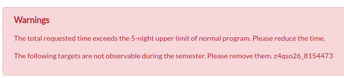
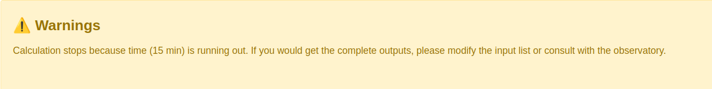

# Total Time Estimate

The total exposure time required for an uploaded target list is estimated using the online PFS Pointing Planner (PPP).

## Run

- Press <u>"Simulate" button</u> to run the online PPP.

- The running time ranges from a few minutes to hours depending on the input target list. To save computional resources, the online PPP will stop if <b>the running time exceeds 15 minutes</b>. Please prevent uploading a huge list.

## Results

### 1. Status

PPP will give a status report of the outputs.

!!! warning "Warnings are raised in the following cases:"

    - the total requested time exceeds the 5-night upper limit for the normal progam;
    - the online PPP stops due to the running out of time.

For example, 

<figure markdown>
  { width="800" }
  <!-- <figcaption>Status indicators</figcaption> -->
</figure>

<figure markdown>
  { width="1000" }
  <!-- <figcaption>Status indicators</figcaption> -->
</figure>

If no warnings are reported, it will show 
<figure markdown>
  { width="1000" }
  <!-- <figcaption>Status indicators</figcaption> -->
</figure>

### 2. Table

A table including the following information will be displayed, and its contents will be changed by dragging the slider above.

| Name                  |  Unit     | Description                                                                                        |
|-----------------------|-----------|----------------------------------------------------------------------------------------------------|
| resolution            |           | `low`, `medium` or `total`                                                                         |
| N_ppc                 |           | Number of pointings, can be adjusted by the slider                                                 |
| Texp                  | hour      | Total on-source time requested                                                                     |
| Texp                  | fiberhour | Total on-source time requested                                                                     |
| Request time         | hour      | Total request time including overheads (calibration frames taken for each night)                   |
| Used fiber fraction   |  %        | Average fiber usage fraction of pointings                                                          |
| Fraction of PPC <30%  |  %        | Fration of pointings having the fiber usage fraction < 30%                                         |
| P_all                 |  %        | Completion rate of the entire program                                                              |
| P_[1-9]               |  %        | Completion rate of each priority group                                                             |

- if only one resolution mode (low or medium) is requred, the table will only show information in that mode;
- if both modes are required, a third row `total` will be added

### 3. Figures

The <u>Completion Rate</u> (left), <u>Fiber Usage Fraction</u> (middle) and <u>Target Distribution</u> (right) will be shown.

- Completion Rate
    - title displays the resolution mode 
    - `PPC_id`: ID of PFS pointing center, pointings are sorted by the total priority of targets assigned on them
    - thick black solid line: completion rate of the entire program 
    - thick red solid line: completion rate of the primary sample (which has the smallest internal priority P) 
    - other lines: completion rate of each priority group   
    - vertical gray dashed line: number of pointings required, can be adjusted by the slider above

- Fiber Usage Fraction
    - title displays the resolution mode 
    - `PPC_id`: ID of PFS pointing center, pointings are sorted by the total priority of targets assigned on them
    - thick red solid line: average fiber usage fraction of pointings  
    - vertical gray dashed line: number of pointings required, can be adjusted by the slider above

- Target Distribution
    - targets in each priority group are plotted by different colors, with the primary sample (which has the smallest internal priority P) in red
    - transparent gray hexagons show the pointings 
