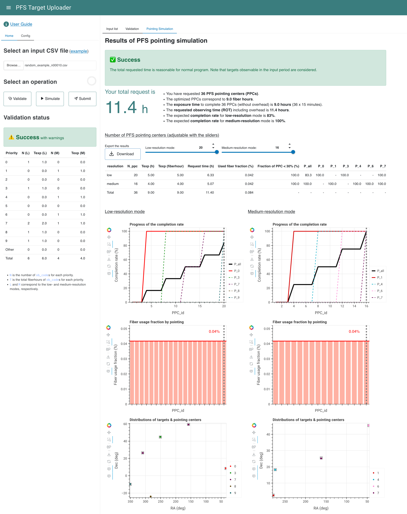
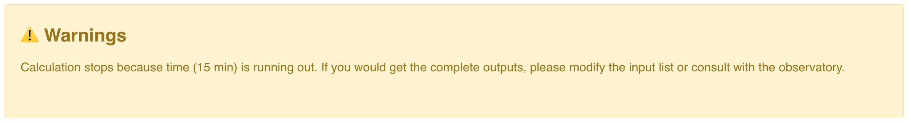

# PFS Pointing Simulation

The total exposure time required for a target list can be estimated using the online PFS Pointing Planner (PPP).

The online PPP will simulate the pointing after the validation of the input target list.
The procedure is briefly listed below:

1. Create a weight map on the sky for the input objects by using coordinates and priorities.
2. Pick a density peak with the highest weight and assign PFS fibers using [the netflow algorithm](https://github.com/Subaru-PFS/ets_fiberalloc/).
3. Repeat 1 and 2 until all input targets are completed or running time exceeds about 15 minutes.

## Run the online PPP

- Press **_Simulate_** button in the sidebar to run the online PPP.
- The running time ranges from a few minutes to hours depending on the input target list. To save computational resources, the online PPP will **stop** if the running time exceeds **15 minutes**. Please prevent uploading a huge list.
- In the case of [the example file](examples/example_perseus_cluster_r60arcmin.csv) shown in the [Inputs](inputs.md) section, the computational time would be about 10 seconds.

## Understand the results

<figure markdown>
  
  <figcaption>Screenshot of the online PPP results</figcaption>
</figure>

### Simulation status

The online PPP will give a status report of the pointing simulation.

!!! warning "Warnings are raised in the following cases:"

    - The total requested time exceeds the 5-night upper limit for the normal program (35 hours).
    - The running time exceeds 15 minutes.

#### Examples of status

<figure markdown>
  { width="1000" }
  { width="995" }
  <figcaption>(Top) A warning to indicate that the total time to complete all targets in the list is estimated to exceed 5 nights</figcaption>
  <figcaption>(Bottom) A warning to indicate that the running time exceeds 15 minutes.</figcaption>
</figure>

<figure markdown>
  { width="1000" }
  <figcaption>Status panel when no warning is returned.</figcaption>
</figure>

### Summary of the PFS pointing simulation

A summary of the pointing simulation is shown as a list. The total request time and the following information is highlighted.

- Number of PFS pointing centers (PPCs)
- Corresponding fiberhours (i.e., sum of exposure time for assigned targets)
- Total on-source time to complete the number of PPCs above assuming 15 minutes/pointing
- Total requested observing time (ROT) including overhead
- The expected completion rate for low- and medium-resolution modes, respectively

If the ROT exceeds the 5-night limit for openuse program, the ROT is shown in red, otherwise it is shown in green.

### Download the results

Results from the online PPP can be downloaded as a ZIP file by pressing the **_Download_** button.
See `README.txt` in the ZIP file for the content.

### Table of the results

A table including the following information will be displayed.
The table contents change interactively with the draggable slider(s) above the table.

| Name                 | Unit      | Description                                                                                                        |
|----------------------|-----------|--------------------------------------------------------------------------------------------------------------------|
| resolution           |           | `low`, `medium` or `total`                                                                                         |
| N_ppc                |           | Number of pointings, can be adjusted by the slider                                                                 |
| Texp                 | hour      | Total on-source time requested to complete `N_ppc` pointings                                                       |
| Texp                 | fiberhour | Total on-source fiberhours requested                                                                               |
| Request time         | hour      | Total request time including overheads (e.g., calibration frames, fiber configuration, readout, telescope slewing) |
| Fiber usage fraction | %         | Average fiber usage fraction of pointings                                                                          |
| Fraction of PPC <30% | %         | Fration of pointings having the fiber usage fraction < 30%                                                         |
| P_all                | %         | Completion rate of the entire program                                                                              |
| P_[0-9]              | %         | Completion rate of each priority group                                                                             |

- If only one resolution mode (low or medium) is used, the table will only show information in that mode.
- The completion rates are estimated by `N(tgt_complete)/N(tgt)`, where `N(tgt_complete)` means the number count of targets with the requested exposure time **fully** finished.

### Interactive plots of the results

The <u>Completion Rate</u> (top), <u>Fiber Usage Fraction</u> (middle) and <u>Target Distribution</u> (bottom) will be shown for each resolution mode.

#### Completion Rate
`PPC_id`
: ID of PFS pointing center, PPCs are sorted by the total priority of targets assigned on them

Thick black solid line
: Completion rate of the entire program

Thick red solid line
: Completion rate of the primary sample (which has the smallest internal priority P)

Other lines
: Completion rate of each priority group

Vertical gray dashed line
: Number of pointings required, can be adjusted by the slider above

#### Fiber Usage Fraction
`PPC_id`
: ID of PFS pointing center, pointings are sorted by the total priority of targets assigned on them

Thick red solid line
: average fiber usage fraction of pointings

Vertical gray dashed line
: number of pointings required, can be adjusted by the slider above

#### Target Distribution

Targets in each priority group are plotted by different colors, with the primary sample (which has the smallest internal priority P) in red.
Transparent gray hexagons show the PFS FoV at pointing centers.
