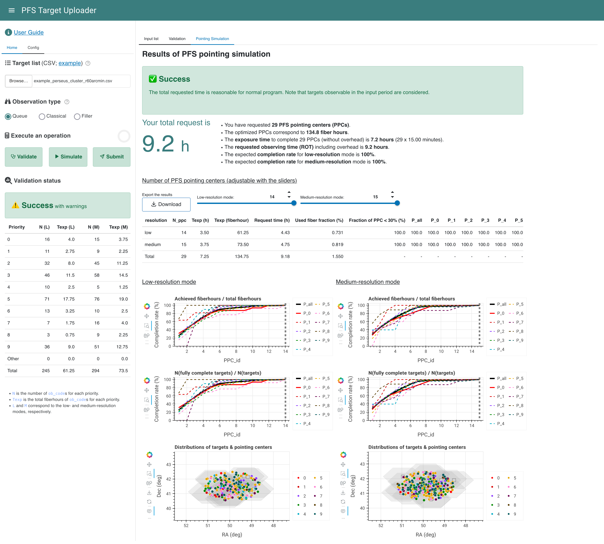

# PFS Pointing Simulation

The total exposure time required for a target list can be estimated using the online PFS Pointing Planner (PPP).

The online PPP will simulate the pointing after the validation of the input target list.
The procedure is briefly listed below:

1. Create a weight map on the sky for the input objects by using coordinates and priorities.
2. Pick a density peak with the highest weight and assign PFS fibers using [the netflow algorithm](https://github.com/Subaru-PFS/ets_fiberalloc/).
3. Repeat 1 and 2 until all input targets are completed or the running time exceeds about 15 minutes.

!!! note

    Please be aware that the online PPP only simulates the classical-mode observation without sharing fibers with other programs. We advise users to consider the results as a statistical reference. The final pointing coordinates and fiber assignments after sharing fibers may **differ from the simulated results provided here**.

## Run the online PPP

### Execute the online PPP

- Press the **_Simulate_** button in the sidebar to run the online PPP.
- The running time ranges from a few minutes to hours depending on the input target list. To save computational resources, the online PPP will **stop** if the running time exceeds **15 minutes**. Please prevent uploading a huge list.
- In the case of [the example file](examples/example_perseus_cluster_r60arcmin.csv) shown in the [Inputs](inputs.md) section, the computational time would be about 10 seconds.

#### Different observation types

- **Queue** type (default): the online PPP will run to automatically determine pointings with a fixed individual exposure time of 900 seconds
- **Classical** type: the online PPP can accept a custom individual exposure time and/or pointing list from the `Config` tab
in the side panel

    - Mandatory fields of the custom pointing list are listed below. An example can be seen [here](examples/example_ppclist.csv).

    | Name           | Datatype | Unit   | Description                                                                                        |
    |----------------|----------|--------|----------------------------------------------------------------------------------------------------|
    | ppc_ra         | float    | degree | Right Ascension (J2000.0 or ICRS at the epoch of 2000.0)                                           |
    | ppc_dec        | float    | degree | Declination (J2000.0 or ICRS at the epoch of 2000.0)                                               |
    | ppc_resolution | str      |        | Grating used in the red optical arms. `L` for the low resolution and `M` for the medium resolution |

    - Optional fields of the custom pointing list are listed below.

    | Name         | Datatype | Unit   | Description                                 |
    |--------------|----------|--------|---------------------------------------------|
    | ppc_pa       | float    | degree | Position angle                              |
    | ppc_priority | float    |        | Priority of the pointing center in the list |
    | ppc_code     | str      |        | Name of the pointing center                 |

<figure markdown>
  { width="300"}
  { width="300" }
  <figcaption>(Left) The Config tab for the queue mode. (Right) The Config tab for the classical mode</figcaption>
</figure>

- **Filler** type: the online PPP will be disabled due to the limited computational resources

## Understand the results

<figure markdown>
  
  <figcaption>Screenshot of the online PPP results</figcaption>
</figure>

### Simulation status

The online PPP will give a status report of the pointing simulation.

!!! danger "Errors are raised in the following cases"

    - (Usually under **Classical** mode) No fibers can be assigned since the input pointings can not complete any targets. For example, if a target requests 1800 sec, but only one pointing with an individual exposure time of 900 sec is given, no fiber can be assigned to the target since it can not be completed. Adding pointings or modifying individual exposure time can solve the problem.
    - No fibers can be assigned due to no available fibers. Slightly shifting the pointing by ~0.2-0.5 degree can solve the problem in most cases.
    - The running time exceeds 15 minutes.

!!! warning "Warnings are raised in the following cases:"

    - The total requested time exceeds the 5-night upper limit for the normal program (35 hours).

#### Examples of status

<figure markdown>
  { width="1000" }
  { width="995" }
  <figcaption>(Top) A warning to indicate that the total time to complete all targets in the list is estimated to exceed 5 nights</figcaption>
  <figcaption>(Bottom) An error to indicate that the running time exceeds 15 minutes.</figcaption>
</figure>

<figure markdown>
  { width="1000" }
  <figcaption>Status panel when no warning is returned.</figcaption>
</figure>

### Summary of the PFS pointing simulation

A summary of the pointing simulation is shown as a list. The total request time and the following information is highlighted.

- Number of PFS pointing centers (PPCs)
- Corresponding fiberhours (i.e., the sum of exposure time for assigned targets)
- Total on-source time to complete the number of PPCs above assuming 15 minutes/pointing
- Total requested observing time (ROT) including overhead
- The expected completion rate for low- and medium-resolution modes, respectively

If the ROT exceeds the 5-night limit for an openuse program, the ROT is shown in red, otherwise, it is shown in green.

### Download the results

Results from the online PPP can be downloaded as a ZIP file by pressing the **_Download_** button.
See `README.txt` in the ZIP file for the content.

### Table of the results

A table including the following information will be displayed.
The table contents change interactively with the draggable slider(s) above the table.

| Name                 | Unit      | Description                                                                                                        |
|----------------------|-----------|--------------------------------------------------------------------------------------------------------------------|
| resolution           |           | `low`, `medium` or `total`                                                                                         |
| N_ppc                |           | Number of pointings, can be adjusted by the slider                                                                 |
| Texp                 | hour      | Total on-source time requested to complete `N_ppc` pointings                                                       |
| Texp                 | fiberhour | Total on-source fiberhours requested                                                                               |
| Request time         | hour      | Total request time including overheads (e.g., calibration frames, fiber configuration, readout, telescope slewing) |
| Used fiber fraction  | %         | Average fiber usage fraction of pointings                                                                          |
| Fraction of PPC <30% | %         | Fration of pointings having the fiber usage fraction < 30%                                                         |
| P_all                | %         | Completion rate of the entire program                                                                              |
| P_[0-9]              | %         | Completion rate of each priority group                                                                             |

- If only one resolution mode (low or medium) is used, the table will only show information in that mode.
- The completion rates are calculated using `FiberHour_allocated / FiberHour_total`. It's important to note that this calculation includes partially observed targets in each pointing.

### Interactive plots of the results

The <u>Completion Rate</u> (top and middle) and <u>Target Distribution</u> (bottom) will be shown for each resolution mode.

#### Completion Rate
`PPC_id`
: ID of PFS pointing center, PPCs are sorted by the total priority of targets assigned on them

Thick black solid line
: Completion rate of the entire program

Thick red solid line
: Completion rate of the primary sample (which has the smallest internal priority P)

Other lines
: Completion rate of each priority group

Vertical gray dashed line
: Number of pointings required, can be adjusted by the slider above

#### Target Distribution

Targets in each priority group are plotted in different colors, with the primary sample (which has the smallest internal priority P) in red.
Transparent gray hexagons show the PFS FoV at pointing centers.

## Fixed Parameters

In the PPP calculation, the following parameters are fixed.

| Description                            | Value | Unit    |
|----------------------------------------|------:|---------|
| Number of fibers                       |  2394 |         |
| Number of calibrators                  |   200 |         |
| Fiber configuration time per exposure  |   180 | s       |
| Miscellaneous overheads[^1]            |   120 | s       |
| Calibration and focusing overheads[^2] |   1.2 | h/night |
| Maximum PPP running time               |   900 | s       |
| Maximum number of pointings            |   200 |         |

[^1]: Overhead time charged for individual exposure such as readout, slew the telescope, field acquisition, and guide star acquisition.
[^2]: Overhead time to obtain calibration data and focusing. Current best estimate is 1.2 h per night. That is, 1.2 h is charged for every 8.8 h individual exposures.
