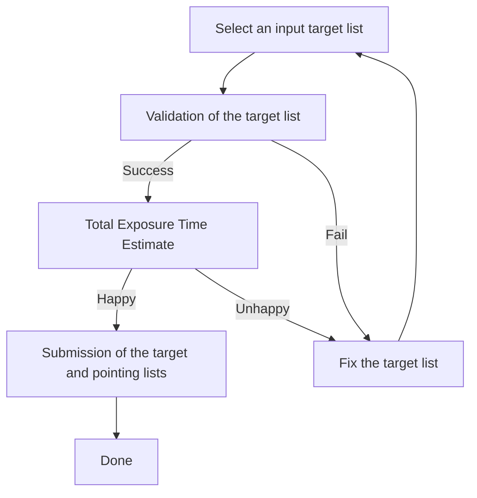

# Welcome

The PFS Target Uploader is a web app to and submit the target list supplied by users with time estimate by a pointing simulation.

## Workflow

## Table of Contents

- :material-list-box-outline:{ .lg .middle } [__Input Target List__](inputs.md)

    ---

    Understand the file format and contents of your input target list required for PFS observation.

    [:octicons-arrow-right-24: Input Target List](inputs.md)

- :material-stethoscope:{ .lg .middle } [__Validation__](validation.md)

    ---

    Validate your input target list and understand the output messages.

    [:octicons-arrow-right-24: Validate the input target list](validation.md)

- :material-calculator:{ .lg .middle } [__Total Exposure Time Estimate__](PPP.md)

    ---

    Estimate the observing time to complete your targets by the PFS pointing planner.

    [:octicons-arrow-right-24: Estimate the observing time](PPP.md)

- :material-file-send-outline:{ .lg .middle } [__Submission__](submission.md)

    ---

    Submit the target list and get `Upload ID` for your proposal.

    [:octicons-arrow-right-24: Submit the target list and time request](submission.md)

-   :material-chat-question-outline:{ .lg .middle } [__FAQ & Known Issues__](issues.md)

    ---

    Frequently Asked Questions and known issues.

    [:octicons-arrow-right-24: FAQ & Known Issues](issues.md)

-   :material-account-box-outline:{ .lg .middle } [__Contact__](contact.md)

    ---

    If you have any questions, comments, and suggestions, please feel free to contact us.

    [:octicons-arrow-right-24: Contact Us](issues.md)

