# Welcome

The [PFS Target Uploader](https://pfs-etc.naoj.hawaii.edu/uploader/) is a web app to validate and submit the target list
supplied by users with an observing time estimate by a pointing simulation.

!!! info
    **August 10, 2024 (HST)**

    In the examples of [input target lists](inputs.md), column names for fluxes are found to be incorrect
    for the initial version released together with S25A CfP on August 5, 2024 (HST).
    The `r`- (`i`-) band filters for HSC need to be either `r_old_hsc` or `r2_hsc` (`i_old_hsc` or `i2_hsc`).
    We have updated the examples with correct information for the correct examples.
    Please see the [Filters section](inputs.md#filters) for the details.

## Table of Contents

- :material-list-box-outline:{ .lg .middle } [__Prepare Your Target List__](inputs.md)

    ---

    Understand the file format and contents of your input target list required for PFS observation.

- :material-stethoscope:{ .lg .middle } [__Validate Your Target List__](validation.md)

    ---

    Check if your input target list meets the requirements and understand errors and warnings.

- :material-calculator:{ .lg .middle } [__Simulate PFS Pointings__](PPP.md)

    ---

    Estimate required observing time to complete your targets by using the PFS pointing planner.

- :material-file-send-outline:{ .lg .middle } [__Submit Your Targets__](submission.md)

    ---

    Submit the target list and receive a `Upload ID`.

- :material-chat-question-outline:{ .lg .middle } [__FAQ & Known Issues__](issues.md)

    ---

    Check frequently asked questions and known issues first when you have any troubles with the app.

- :material-account-box-outline:{ .lg .middle } [__About Us__](about.md)

    ---

    Contact information and the privacy policy of the app and documationation are available.

## Workflow

```mermaid
graph TD
  subgraph Filler["`**Filler Mode**&nbsp&nbsp&nbsp&nbsp&nbsp&nbsp&nbsp&nbsp&nbsp&nbsp&nbsp&nbsp&nbsp&nbsp&nbsp&nbsp&nbsp&nbsp&nbsp&nbsp&nbsp&nbsp&nbsp&nbsp&nbsp&nbsp&nbsp&nbsp&nbsp&nbsp&nbsp&nbsp&nbsp&nbsp&nbsp&nbsp&nbsp&nbsp&nbsp&nbsp&nbsp&nbsp&nbsp&nbsp&nbsp&nbsp&nbsp&nbsp&nbsp&nbsp&nbsp&nbsp&nbsp&nbsp&nbsp&nbsp&nbsp&nbsp&nbsp&nbsp&nbsp&nbsp&nbsp&nbsp&nbsp&nbsp&nbsp&nbsp&nbsp&nbsp&nbsp&nbsp&nbsp&nbsp&nbsp&nbsp&nbsp&nbsp&nbsp&nbsp&nbsp&nbsp&nbsp`"]
  start3[Start] --> select_file3[Select an input target list];
  select_file3 --> validate3[Validate the target list];
  validate3 -->|Success| submit_results3[Submit the target list];
  validate3 -->|Fail| fix_errors3[Fix the target list];
  fix_errors3 --> select_file3;
  submit_results3 --> done3[Done];
  end
  subgraph Classical["`**Classical Mode**&nbsp&nbsp&nbsp&nbsp&nbsp&nbsp&nbsp&nbsp&nbsp&nbsp&nbsp&nbsp&nbsp&nbsp&nbsp&nbsp&nbsp&nbsp&nbsp&nbsp&nbsp&nbsp&nbsp&nbsp&nbsp&nbsp&nbsp&nbsp&nbsp&nbsp&nbsp&nbsp&nbsp&nbsp&nbsp&nbsp&nbsp&nbsp&nbsp&nbsp&nbsp&nbsp&nbsp&nbsp&nbsp&nbsp&nbsp&nbsp&nbsp&nbsp&nbsp&nbsp&nbsp&nbsp&nbsp&nbsp&nbsp&nbsp&nbsp&nbsp&nbsp&nbsp&nbsp&nbsp&nbsp&nbsp&nbsp&nbsp&nbsp&nbsp&nbsp&nbsp&nbsp&nbsp&nbsp&nbsp&nbsp&nbsp&nbsp&nbsp&nbsp&nbsp&nbsp&nbsp&nbsp&nbsp&nbsp&nbsp&nbsp&nbsp&nbsp&nbsp&nbsp&nbsp&nbsp&nbsp&nbsp&nbsp&nbsp&nbsp&nbsp&nbsp&nbsp&nbsp&nbsp&nbsp&nbsp&nbsp&nbsp&nbsp`"]
  start2[Start] --> select_file2[Select an input target list];
  select_file2 --> validate2[Validate the target list];
  validate2 -->|Success| setConfig2["(Optional) Set Config"]
  validate2 -->|Fail| fix_errors2[Fix the target list];
  fix_errors2 --> select_file2;
  setConfig2 --> run_ppp2[Simulate PFS pointings];
  run_ppp2 -->|Happy| submit_results2[Submit the target list];
  run_ppp2 -->|Unhappy| fix_errors2;
  run_ppp2 -->|Unhappy| setConfig2;
  submit_results2 --> done2[Done];
  end
  subgraph Queue["`**Queue Mode**&nbsp&nbsp&nbsp&nbsp&nbsp&nbsp&nbsp&nbsp&nbsp&nbsp&nbsp&nbsp&nbsp&nbsp&nbsp&nbsp&nbsp&nbsp&nbsp&nbsp&nbsp&nbsp&nbsp&nbsp&nbsp&nbsp&nbsp&nbsp&nbsp&nbsp&nbsp&nbsp&nbsp&nbsp&nbsp&nbsp&nbsp&nbsp&nbsp&nbsp&nbsp&nbsp&nbsp&nbsp&nbsp&nbsp&nbsp&nbsp&nbsp&nbsp&nbsp&nbsp&nbsp&nbsp&nbsp&nbsp&nbsp&nbsp&nbsp&nbsp&nbsp&nbsp&nbsp&nbsp&nbsp&nbsp&nbsp&nbsp&nbsp&nbsp&nbsp&nbsp&nbsp&nbsp&nbsp&nbsp&nbsp&nbsp&nbsp&nbsp&nbsp&nbsp&nbsp&nbsp&nbsp&nbsp&nbsp&nbsp&nbsp&nbsp&nbsp&nbsp&nbsp&nbsp&nbsp&nbsp&nbsp&nbsp&nbsp&nbsp&nbsp&nbsp&nbsp&nbsp&nbsp&nbsp&nbsp&nbsp&nbsp&nbsp`"]
  start1[Start] --> select_file1[Select an input target list];
  select_file1 --> validate1[Validate the target list];
  validate1 --> |Success|run_ppp1[Simulate PFS pointings];
  validate1 --> |Fail|fix_errors1[Fix the target list];
  fix_errors1 --> select_file1;
  run_ppp1 -->|Happy| submit_results1[Submit the target list];
  run_ppp1 -->|Unhappy|fix_errors1;
  submit_results1 --> done1[Done];
  end
  
```

## Demo

{: style='width: 100%'}

## Last Update

August 10, 2024 (HST)

See the [Releases on GitHub repository](https://github.com/Subaru-PFS/spt_target_uploader/releases) for the details.
