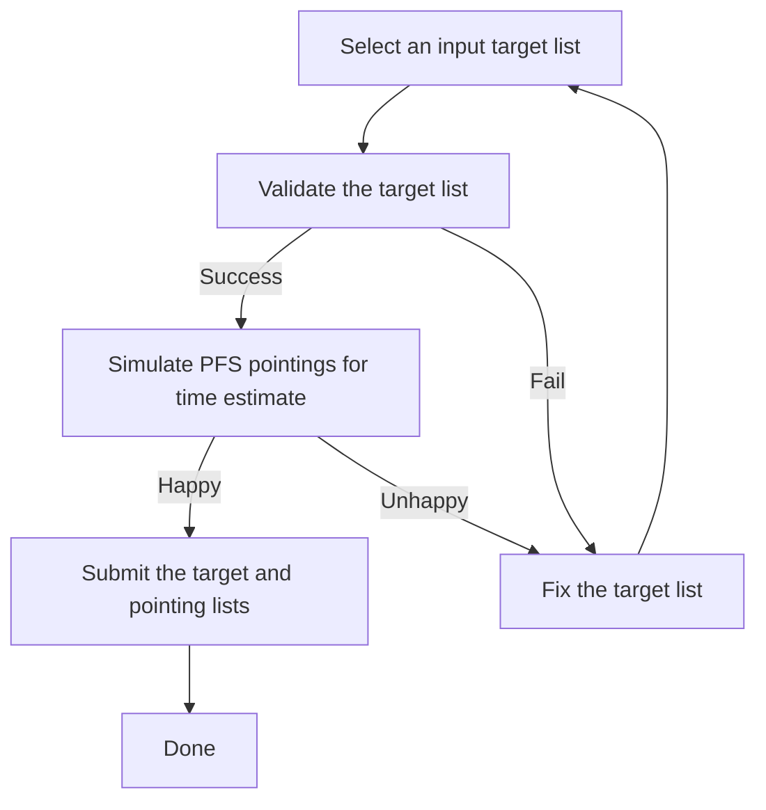

# Welcome

The PFS Target Uploader is a web app to validate and submit the target list supplied by users with an observing time estimate by a pointing simulation.

## Workflow

## Table of Contents

- :material-list-box-outline:{ .lg .middle } [__Prepare Your Target List__](inputs.md)

    ---

    Understand the file format and contents of your input target list required for PFS observation.

    [:octicons-arrow-right-24: Input Target List](inputs.md)

- :material-stethoscope:{ .lg .middle } [__Validate Your Target List__](validation.md)

    ---

    Check if your input target list meets the requirements and understand errors and warnings.

    [:octicons-arrow-right-24: Validate the input target list](validation.md)

- :material-calculator:{ .lg .middle } [__Simulate PFS Pointings__](PPP.md)

    ---

    Estimate required observing time to complete your targets by using the PFS pointing planner.

    [:octicons-arrow-right-24: Simulate PFS pointings](PPP.md)

- :material-file-send-outline:{ .lg .middle } [__Submit Your Targets and Pointings__](submission.md)

    ---

    Submit the target list and pointing information and receive a `Upload ID`.

    [:octicons-arrow-right-24: Submit the target list and time request](submission.md)

-   :material-chat-question-outline:{ .lg .middle } [__FAQ & Known Issues__](issues.md)

    ---

    Check frequently asked questions and known issues first when you have any troubles with the app.

    [:octicons-arrow-right-24: FAQ & Known Issues](issues.md)

-   :material-account-box-outline:{ .lg .middle } [__Contact__](contact.md)

    ---

    If you have any questions, comments, or suggestions on the app, please feel free to contact us.

    [:octicons-arrow-right-24: Contact Us](contact.md)

