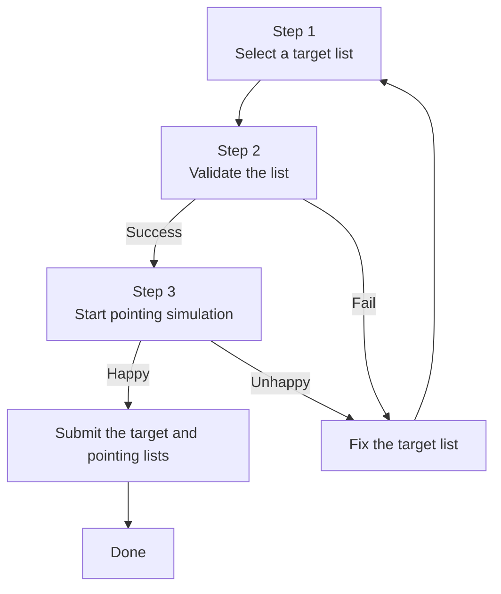

# Welcome

The PFS Target Uploader is a web app to validate and submit the target list supplied by users.

## Workflow

## [Input Target List](inputs.md)

- [Content of the list](inputs.md#contents-of-the-list)
- [File format](inputs.md#file-format)
- [Example file](inputs.md#example)

## [Validation](validation.md)

- [Validation stages](validation.md#stages)
- [Understand the results](validation.md#results)

## [Total Exposure Time Estimate](PPP.md)

- [Run](PPP.md#run)
- [Understand the results](PPP.md#results)

## [Submission](submission.md)

- [Submit target list](submission.md#submit-the-target-list)
- [Submit PPP outputs](submission.md#submit-the-ppp-outputs)

## [Contact](contact.md)

Any feedback is welcome. Please contact Masato Onodera and Wanqiu He (Subaru Telescope, NAOJ) via PFS Slack and/or email (<monodera@naoj.org>, <wanqiu.he@nao.ac.jp>).
