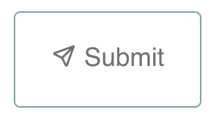

# Submission

## Submit the target list
Once the validation is finished without errors, the Submit button becomes active and you can click it to submit your target list.

<figure markdown>
  { width="200" }
  <figcaption>Validate button</figcaption>
</figure>

<figure markdown>
  { width="200" }
  <figcaption>Inactive Submit button</figcaption>
</figure>

<figure markdown>
  { width="200" }
  <figcaption>Active Submit button</figcaption>
</figure>

When uploading the file to our storage is finished, a message panel is shown to tell you about the successful submission.

<figure markdown>
  { width="600" style="margin: 0; border: 1px solid gray;" }
  <figcaption>Message for successful submission</figcaption>
</figure>

The message contains `Upload ID` which is a 8-bit hex string unique to the submission.
Please keep `Upload ID` with you.

The `Upload ID` may be used for the following purposes.

- Inquiry to the observatory when you have any issues.
- Proposal preparation (the observatory will require `Upload ID` for PFS proposals at the time of the proposal submission.)

### Errors

When the Submission button is clicked, the validation process runs again. In a rare case, the validation fails and raises an error.
