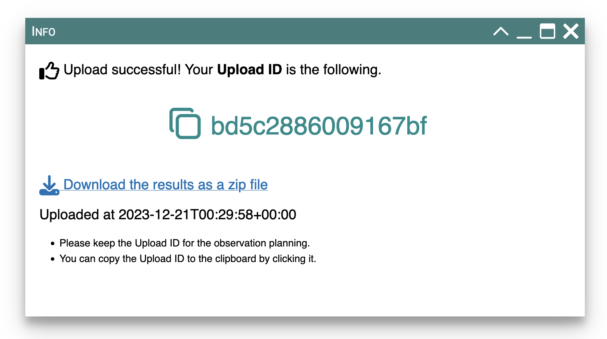

# Submission of the target list

## How to submit

Once the validation is finished with success, the **_Submit_** button becomes active.
Then, you can click it to submit your target list if you are happy with the results of the total time estimate.

<figure markdown>
  { width="150" }
  { width="150" }
  <figcaption>(Left) Inactive Submit button. (Right) Active Submit button at mouse over</figcaption>
</figure>

When the Submit button is clicked, the validation process runs again before sending outputs to the observatory.
The validation fails in rare cases and error messages will be displayed in the sidebar and the Validation tab in the main panel.

## What to be submitted

The following information will be sent to the observatory.

- Original target list
- Cleaned target list shown in the "Input list" tab as a table
- Summary of the targets shown in the sidebar as a table
- Summary of the time estimate shown in the "Pointing Simulation" tab
- List of PFS pointings derived by the time estimate calculation
- Figures shown in the "Pointing Simulation" tab

## After the submission

When uploading output files to the observatory's storage is completed,
a message panel will be popped up to notify the successful submission.

<figure markdown>
  { width="600" }
  <figcaption>Example of the message panel for successful submission</figcaption>
</figure>

### Upload ID

The message contains `Upload ID` (`bd5c2886009167bf` in the above example) which is an 8-bit hex string unique to the submission.
Please copy the `Upload ID` by clicking the area around the `Upload ID` and keep it with you.

!!! note "Lost the `Upload ID`?"

    Once you close the message panel without copying the `Upload ID` or downloading the ZIP file,
    there is no trivial way to recover your `Upload ID`.
    If you forget to record your `Upload ID`, you may want to do the following ways.

    - [Contact us](contact.md) and the observatory staff will look up `Upload ID`. We would need to know the original filename and approximate time of the submission.
    - You can repeat the entire process again as a new submission. A new `Upload ID` will be issued and you can use it for subsequent processes.

The `Upload ID` may be used for the following purposes.

- Inquiry to the observatory when you have any issues with the target list and pointing list.
- Proposal preparation (you need to write down `Upload ID` in the proposal to apply for observing time with PFS).

### Download the results

You can also download the results following the link "Download the results as a zip file".
The zip file contains files sent to the observatory as listed in the section above.
In contrast to the ZIP file downloadable after the time estimate, the files contain `Upload ID` in filenames and header sections of `.ecsv` files.

