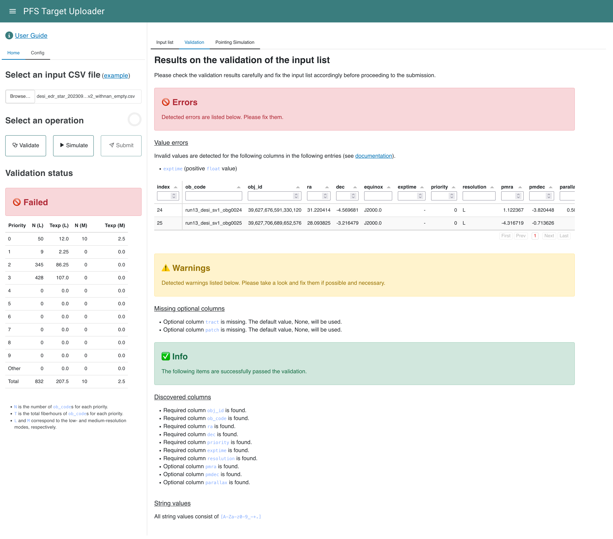

# Validation of Target Lists

## Validation items

An input target list is validated against the following items.

### Filetype

The input file must be in the CSV (comma-separated values) or ECSV (enhanced character-separated values) formats.

!!! danger "Errors are raised in the following cases"

    - When the `Validate` or `Simulate` button is clicked without selecting an input file, an error notification will be shown.
    - When the input file cannot be read, an error notification will be shown. This is likely to be caused by wrong formats in cells.

### Column names

The names of columns in the input list are checked against the required and optional keys except for flux-related ones.

!!! danger "Errors message is raised as follows for required columns"

    - A required keyword `key name` is missing.

!!! warning "Warning message is raised as follows for missing optional columns"

    - Optional column `key name` is missing. The default value, `default value`, will be used.

!!! success "Info messages are shown as follows for detected columns"

    - Required column `key name` is found.
    - Optional column `key name` is found.

### String values

String values are validated whether they contain only allowed characters, `[A-Za-z0-9_-+.]`.
Along with the comments, a table is shown for rows with invalid values.

!!! danger "Error message is raised as follows for required columns"

    String values must consist of [A-Za-z0-9_-+.]. The following entries must be fixed.

!!! success "Info message is shown as follows for successful validation"

    All string values consist of `[A-Za-z0-9_-+.]`

### Data ranges

Value of `ra`, `dec`, `priority`, `exptime`, and `resolution` are checked whether they are in the allowed ranges.
Along with the comments, a table is shown for rows with invalid values.

!!! note "Following checks are conducted and errors are raised when violations are detected"

    - $0 \le \mathrm{ra} \le 360$.
    - $-90 \le \mathrm{dec} \le 90$.
    - `priority` must be an integer in $[0, 9]$.
    - `exptime` must be positive.
    - `resolution` must be either `L` or `M`.

!!! danger "Error message is raised as follows"

    Invalid values are detected for the following columns in the following entries.

!!! success "Info message is shown as follows for successful validation"

    All values of `ra`, `dec`, `priority`, `exptime`, and `resolution` satisfy the allowed ranges.

### Flux columns

Flux columns are validated against conditions described in the [Flux Information Section](inputs.md#about-flux-information).

!!! danger "Error message is raised as follows"

    No flux information found in the following `ob_code`s. Detected filters are the following: `<detected filter columns>`

!!! success "Info message is shown as follows"

    All `ob_code`s have at least one flux information. The detected filters are the following: `<detected filter columns>`

### Target visibility

Target visibility is checked by comparing the requested exposure time is shorter than the time when the target elevation is more than 30 degrees above the horizon between 18:30 and 5:30+1day. The data range can be configured in the `config` tab in the sidebar. Only visible targets will be considered for the pointing simulation. Along with the error and warning messages, invalid rows will be displayed.

!!! danger "Error message is raised when no `ob_code` is visible"

    None of `ob_code`s in the list is visible in the input observing period.

!!! warning "Warning message is raised when one or more `ob_code`s are not visible"

    `N` `ob_code`s are not visible in the input observing period

!!! success "Info message is shown when all `ob_code`s are visible"

    All `ob_code`s are visible in the input observing period

### Duplicated `ob_code` and `(obj_id, resolution)`

Duplication of ob_code and obj_id

`ob_code` and `(obj_id, resolution)` are checked not to have duplicates. Along with the error message, invalid rows will be displayed.

!!! danger "Errors are raised in the following case"

    Each `ob_code` and `(obj_id, resolution)` must be unique within a proposal, but duplicate `ob_code` and/or `(obj_id, resolution)`
    are detected in the following targets.

!!! success "Info message is raised for successful validation"
    All `ob_code` and `(obj_id, resolution)` are unique.

## Validation Results

<figure markdown>
  
  <figcaption>An example output after the validation.</figcaption>
</figure>

### `Home` tab in the side panel (left)

#### <u>Select an input CSV file</u>

Press the "Browse" button to select a CSV or ECSV file to be validated.

#### <u>Select an operation</u>

##### Validate

A validation process starts if pressed.

##### Simulate

A PFS pointing simulation starts if pressed. Validation of the input file will be carried out before proceeding to the simulation.

##### Submit

Submit the input target list and pointing lists to the observatory. The button will be active after successful validation.

#### <u>Validation status</u>

One of the following validation results will be shown to indicate the validation status.

✅ **Success**
: Validation is successful without any errors and warnings

⚠️ **Success** with warnings
: Validation is successful with warnings. Warnings can be ignored, but please make sure whether they are acceptable or not.

🚫 **Failed**
: Validation is failed. Please check error messages carefully and modify the input target list accordingly.

#### <u>Summary table</u>

Numbers of objects and fiberhours for each priority are displayed for the `L` and `M` resolutions separately.

### `Config` tab in the side panel (left)

You can set the observing period for visibility check. By default, the dates are set to the next semester.

## Main panel (right)

The details of the validation results are shown in the main panel.
First, errors are shown, followed by warnings. The successful checks are shown at the bottom.
Tables containing invalid rows are also shown for each validation process.
Please modify them to make them acceptable for the uploader.
