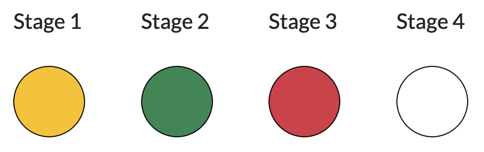

# Validation

Validation of a input target list is carried out in 4 stages.

## Stages

<figure markdown>
  { width="600" }
  <!-- <figcaption>Status indicators</figcaption> -->
</figure>

### Filetype

Whether a proper readable CSV file is provided is checked.

!!! danger "Errors are raised in the following cases"

    - When the `validation`button is clicked without selecting a input file, an error will be raised.
    - When `pandas.read_csv()` fails to read the input CSV file, an error will be raised. This is likely caused by wrong formats in the fields for numbers.

### Mandatory columns

The names of input columns are checked against the required and optional keys except for flux-related ones.

!!! danger "Errors are raised in the following case"

    - A mandatory keyword `key name` is missing. Please add them with proper values.

!!! warning "Warnings are raised in the following case"

    - A mandatory keyword `key name` is missing. Please add them with proper values.

### String values

String data are validated whether they contain only allowed characters, `[A-Za-z0-9_-+.]`.

!!! danger "Errors are raised in the following case"

    - Characters not in `[A-Za-z0-9_-+.]` are detected.

### Data ranges

Value of `ra`, `dec`, `priority`, `exptiem`, and `resolution` are checked whether they are in the allowed ranges.

!!! note "Following checks are conducted and errors are raised when violations are detected"

    - $0 \le \mathrm{ra} \le 360$.
    - $-90 \le \mathrm{dec} \le 90$.
    - `priority` must be positive.
    - `exptime`must be positive.
    - `resolution` must be either `L` or `M`.

### Flux columns

TBD

### Target visibility

TBD

### Duplicated `ob_code`

`ob_code` are checked not to have duplicates.

!!! danger "Errors are raised in the following case"

    - Duplicates in `ob_code` are detected. They must be unique within the list.

## Results

### Side panel (left)

#### <u>Input file selector</u>

Press "Browse" button to select a CSV file to be validated.

#### <u>"Validation" button</u>

Press "Validate" button to start the validation process.

#### <u>Stage indicators</u>

<figure markdown>
  { width="600" }
  <figcaption>Status indicators shows the results for each stage. The above image tells that Stage 1 returned with warnings, Stage 2 finished successfully, Stage 3 finished with errors, and Stage 4 was not carried out.</figcaption>
</figure>

Circles show the status of each stage. Meaning of each color is the following.

**White**
: Validation process was not carried out at **Stage** because it failed at an earlier Stage.

**Yellow**
: Validation at **Stage** ended with warnings.

**Green**
: Validation at **Stage** was successful without errors and warnings.

#### <u>Summary table</u>

Numbers of objects and fiberhours for each priority are displayed for the `L` and `M` resolutions separately.

## Main panel (right)

The details of validation processes are shown in the main panel.

First, errors are shown, followed by warnings. The successful checks are shown at the bottom.

Errors must be fixed before submitting the target list.  Warnings can be ignored, but please consider carefully when ignoring them.
